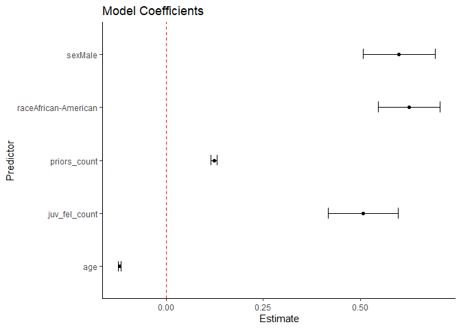
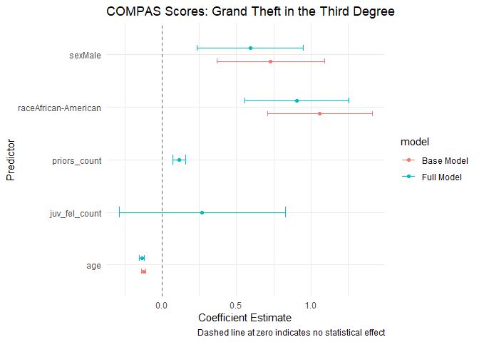
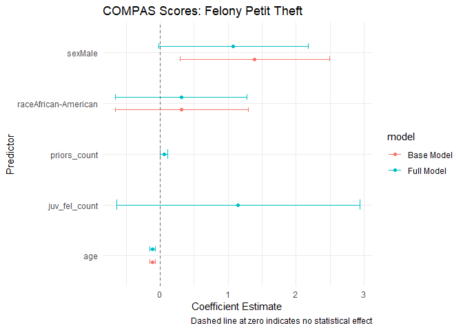
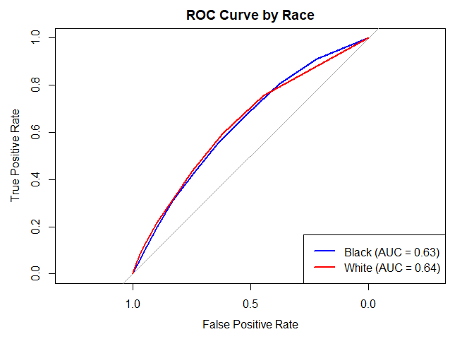
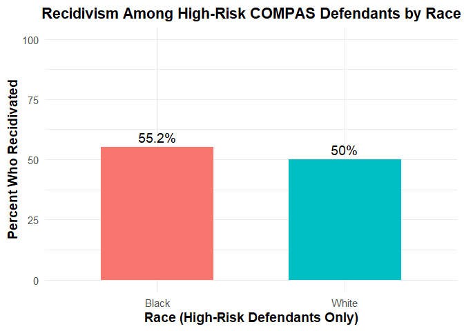

risk-assessment-analysis
================
Maxwell Taylor
2026-04-03

\#Install Packages

\#Load and View Data

``` r
# Update this path as needed
compas_scores <- read_csv("compas-scores.csv")

glimpse(compas_scores)
```

    ## Rows: 11,757
    ## Columns: 47
    ## $ id                      <dbl> 4122, 5262, 7535, 7399, 2471, 1327, 2477, 3628…
    ## $ name                    <chr> "angelica garcia", "grace margri", "ryan milbr…
    ## $ first                   <chr> "angelica", "grace", "ryan", "barissa", "jesus…
    ## $ last                    <chr> "garcia", "margri", "milbry", "clarke", "regue…
    ## $ compas_screening_date   <chr> "4/9/2013", "10/1/2013", "1/10/2013", "5/14/20…
    ## $ sex                     <chr> "Female", "Female", "Male", "Female", "Male", …
    ## $ dob                     <chr> "3/28/1991", "7/8/1967", "3/8/1979", "6/24/198…
    ## $ age                     <dbl> 25, 48, 37, 28, 45, 41, 34, 24, 30, 22, 34, 26…
    ## $ age_cat                 <chr> "25 - 45", "Greater than 45", "25 - 45", "25 -…
    ## $ race                    <chr> "Caucasian", "Caucasian", "African-American", …
    ## $ juv_fel_count           <dbl> 0, 0, 0, 0, 0, 0, 1, 0, 0, 0, 0, 0, 0, 0, 0, 0…
    ## $ decile_score...12       <dbl> 6, 1, 3, 2, 6, 1, 6, 6, 9, 9, 1, 2, 6, 1, 2, 1…
    ## $ juv_misd_count          <dbl> 0, 0, 0, 0, 0, 0, 0, 1, 0, 0, 0, 0, 0, 0, 0, 0…
    ## $ juv_other_count         <dbl> 0, 0, 0, 1, 0, 0, 0, 3, 0, 0, 0, 0, 0, 0, 0, 0…
    ## $ priors_count            <dbl> 0, 2, 1, 1, 4, 2, 9, 4, 7, 3, 5, 2, 3, 0, 0, 2…
    ## $ days_b_screening_arrest <dbl> -1, -66, NA, 0, NA, 0, -1, -1, -1, -1, -1, 0, …
    ## $ c_jail_in               <chr> "4/8/2013 11:29", "7/27/2013 12:28", NA, "5/14…
    ## $ c_jail_out              <chr> "4/9/2013 8:33", "8/29/2013 8:31", NA, "5/14/2…
    ## $ c_case_number           <chr> "13005108CF10A", "13010505CF10A", "10005414CF1…
    ## $ c_offense_date          <chr> "4/8/2013", "7/26/2013", "3/28/2010", "5/14/20…
    ## $ c_arrest_date           <chr> NA, NA, NA, NA, NA, NA, NA, NA, NA, NA, NA, NA…
    ## $ c_days_from_compas      <dbl> 1, 67, 1019, 0, 140, 0, 1, 1, 1, 1, 1, 1, 1, 1…
    ## $ c_charge_degree         <chr> "F", "F", "F", "F", "F", "F", "F", "F", "F", "…
    ## $ c_charge_desc           <chr> "Abuse Without Great Harm", "Abuse Without Gre…
    ## $ is_recid                <dbl> 0, 0, 1, 0, 0, 0, 1, 1, 0, 0, 0, 1, 0, 1, 0, 0…
    ## $ num_r_cases             <lgl> NA, NA, NA, NA, NA, NA, NA, NA, NA, NA, NA, NA…
    ## $ r_case_number           <chr> NA, NA, "13034609TC10A", NA, NA, NA, "15054002…
    ## $ r_charge_degree         <chr> "O", "O", "M", "O", "O", "O", "M", "F", "O", "…
    ## $ r_days_from_arrest      <dbl> NA, NA, NA, NA, NA, NA, NA, 6, NA, NA, NA, NA,…
    ## $ r_offense_date          <chr> NA, NA, "3/22/2013", NA, NA, NA, "9/6/2015", "…
    ## $ r_charge_desc           <chr> NA, NA, "Susp Drivers Lic 1st Offense", NA, NA…
    ## $ r_jail_in               <chr> NA, NA, NA, NA, NA, NA, NA, "2/8/2015", NA, NA…
    ## $ r_jail_out              <chr> NA, NA, NA, NA, NA, NA, NA, "2/9/2015", NA, NA…
    ## $ is_violent_recid        <dbl> 0, 0, 0, 0, 0, 0, 0, 1, 0, 0, 0, 0, 0, 1, 0, 0…
    ## $ num_vr_cases            <lgl> NA, NA, NA, NA, NA, NA, NA, NA, NA, NA, NA, NA…
    ## $ vr_case_number          <chr> NA, NA, NA, NA, NA, NA, NA, "15001799CF10A", N…
    ## $ vr_charge_degree        <chr> NA, NA, NA, NA, NA, NA, NA, "(F3)", NA, NA, NA…
    ## $ vr_offense_date         <chr> NA, NA, NA, NA, NA, NA, NA, "2/2/2015", NA, NA…
    ## $ vr_charge_desc          <chr> NA, NA, NA, NA, NA, NA, NA, "Felony Battery (D…
    ## $ v_type_of_assessment    <chr> "Risk of Violence", "Risk of Violence", "Risk …
    ## $ v_decile_score          <dbl> 4, 1, 1, 2, 4, 1, 5, 6, 7, 9, 2, 3, 5, 1, 2, 1…
    ## $ v_score_text            <chr> "Low", "Low", "Low", "Low", "Low", "Low", "Med…
    ## $ v_screening_date        <chr> "4/9/2013", "10/1/2013", "1/10/2013", "5/14/20…
    ## $ type_of_assessment      <chr> "Risk of Recidivism", "Risk of Recidivism", "R…
    ## $ decile_score...45       <dbl> 6, 1, 3, 2, 6, 1, 6, 6, 9, 9, 1, 2, 6, 1, 2, 1…
    ## $ score_text              <chr> "Medium", "Low", "Low", "Low", "Medium", "Low"…
    ## $ screening_date          <chr> "4/9/2013", "10/1/2013", "1/10/2013", "5/14/20…

``` r
summary(compas_scores)
```

    ##        id            name              first               last          
    ##  Min.   :    1   Length:11757       Length:11757       Length:11757      
    ##  1st Qu.: 2940   Class :character   Class :character   Class :character  
    ##  Median : 5879   Mode  :character   Mode  :character   Mode  :character  
    ##  Mean   : 5879                                                           
    ##  3rd Qu.: 8818                                                           
    ##  Max.   :11757                                                           
    ##                                                                          
    ##  compas_screening_date     sex                dob                 age       
    ##  Length:11757          Length:11757       Length:11757       Min.   :18.00  
    ##  Class :character      Class :character   Class :character   1st Qu.:25.00  
    ##  Mode  :character      Mode  :character   Mode  :character   Median :32.00  
    ##                                                              Mean   :35.14  
    ##                                                              3rd Qu.:43.00  
    ##                                                              Max.   :96.00  
    ##                                                                             
    ##    age_cat              race           juv_fel_count      decile_score...12
    ##  Length:11757       Length:11757       Min.   : 0.00000   Min.   :-1.000   
    ##  Class :character   Class :character   1st Qu.: 0.00000   1st Qu.: 2.000   
    ##  Mode  :character   Mode  :character   Median : 0.00000   Median : 4.000   
    ##                                        Mean   : 0.06158   Mean   : 4.371   
    ##                                        3rd Qu.: 0.00000   3rd Qu.: 7.000   
    ##                                        Max.   :20.00000   Max.   :10.000   
    ##                                                                            
    ##  juv_misd_count     juv_other_count     priors_count    days_b_screening_arrest
    ##  Min.   : 0.00000   Min.   : 0.00000   Min.   : 0.000   Min.   :-597.000       
    ##  1st Qu.: 0.00000   1st Qu.: 0.00000   1st Qu.: 0.000   1st Qu.:  -1.000       
    ##  Median : 0.00000   Median : 0.00000   Median : 1.000   Median :  -1.000       
    ##  Mean   : 0.07604   Mean   : 0.09356   Mean   : 3.082   Mean   :  -0.878       
    ##  3rd Qu.: 0.00000   3rd Qu.: 0.00000   3rd Qu.: 4.000   3rd Qu.:  -1.000       
    ##  Max.   :13.00000   Max.   :17.00000   Max.   :43.000   Max.   :1057.000       
    ##                                                         NA's   :1180           
    ##   c_jail_in          c_jail_out        c_case_number      c_offense_date    
    ##  Length:11757       Length:11757       Length:11757       Length:11757      
    ##  Class :character   Class :character   Class :character   Class :character  
    ##  Mode  :character   Mode  :character   Mode  :character   Mode  :character  
    ##                                                                             
    ##                                                                             
    ##                                                                             
    ##                                                                             
    ##  c_arrest_date      c_days_from_compas c_charge_degree    c_charge_desc     
    ##  Length:11757       Min.   :   0.00    Length:11757       Length:11757      
    ##  Class :character   1st Qu.:   1.00    Class :character   Class :character  
    ##  Mode  :character   Median :   1.00    Mode  :character   Mode  :character  
    ##                     Mean   :  63.59                                         
    ##                     3rd Qu.:   2.00                                         
    ##                     Max.   :9485.00                                         
    ##                     NA's   :742                                             
    ##     is_recid       num_r_cases    r_case_number      r_charge_degree   
    ##  Min.   :-1.0000   Mode:logical   Length:11757       Length:11757      
    ##  1st Qu.: 0.0000   NA's:11757     Class :character   Class :character  
    ##  Median : 0.0000                  Mode  :character   Mode  :character  
    ##  Mean   : 0.2538                                                       
    ##  3rd Qu.: 1.0000                                                       
    ##  Max.   : 1.0000                                                       
    ##                                                                        
    ##  r_days_from_arrest r_offense_date     r_charge_desc       r_jail_in        
    ##  Min.   : -1.00     Length:11757       Length:11757       Length:11757      
    ##  1st Qu.:  0.00     Class :character   Class :character   Class :character  
    ##  Median :  0.00     Mode  :character   Mode  :character   Mode  :character  
    ##  Mean   : 20.41                                                             
    ##  3rd Qu.:  1.00                                                             
    ##  Max.   :993.00                                                             
    ##  NA's   :9297                                                               
    ##   r_jail_out        is_violent_recid  num_vr_cases   vr_case_number    
    ##  Length:11757       Min.   :0.00000   Mode:logical   Length:11757      
    ##  Class :character   1st Qu.:0.00000   NA's:11757     Class :character  
    ##  Mode  :character   Median :0.00000                  Mode  :character  
    ##                     Mean   :0.07502                                    
    ##                     3rd Qu.:0.00000                                    
    ##                     Max.   :1.00000                                    
    ##                                                                        
    ##  vr_charge_degree   vr_offense_date    vr_charge_desc     v_type_of_assessment
    ##  Length:11757       Length:11757       Length:11757       Length:11757        
    ##  Class :character   Class :character   Class :character   Class :character    
    ##  Mode  :character   Mode  :character   Mode  :character   Mode  :character    
    ##                                                                               
    ##                                                                               
    ##                                                                               
    ##                                                                               
    ##  v_decile_score   v_score_text       v_screening_date   type_of_assessment
    ##  Min.   :-1.000   Length:11757       Length:11757       Length:11757      
    ##  1st Qu.: 1.000   Class :character   Class :character   Class :character  
    ##  Median : 3.000   Mode  :character   Mode  :character   Mode  :character  
    ##  Mean   : 3.571                                                           
    ##  3rd Qu.: 5.000                                                           
    ##  Max.   :10.000                                                           
    ##                                                                           
    ##  decile_score...45  score_text        screening_date    
    ##  Min.   :-1.000    Length:11757       Length:11757      
    ##  1st Qu.: 2.000    Class :character   Class :character  
    ##  Median : 4.000    Mode  :character   Mode  :character  
    ##  Mean   : 4.371                                         
    ##  3rd Qu.: 7.000                                         
    ##  Max.   :10.000                                         
    ## 

\#Count of White and Black Defendants

``` r
# Keep only Black and White defendants for the main comparison
compas_clean <- compas_scores %>%
  filter(race %in% c("African-American", "Caucasian")) %>%
  mutate(
    race = factor(race),
    race = relevel(race, ref = "Caucasian"),
    sex = factor(sex),
    race_dummy = ifelse(race == "African-American", 1, 0)
  )

summary(compas_clean$race)
```

    ##        Caucasian African-American 
    ##             4085             5813

``` r
table(compas_clean$race_dummy)
```

    ## 
    ##    0    1 
    ## 4085 5813

\#Distribution of Black and White Defendants

``` r
race_table <- compas_clean %>%
  count(race, name = "Count") %>%
  mutate(Percent = round(100 * Count / sum(Count), 1))

kable(race_table, caption = "Race Distribution in COMPAS Dataset")
```

| race             | Count | Percent |
|:-----------------|------:|--------:|
| Caucasian        |  4085 |    41.3 |
| African-American |  5813 |    58.7 |

Race Distribution in COMPAS Dataset

\#Correlation Score Between Race and Violent Risk Score

``` r
compas_clean %>%
summarise(correlation = cor(race_dummy, v_decile_score, use = "complete.obs"))
```

    ## # A tibble: 1 × 1
    ##   correlation
    ##         <dbl>
    ## 1       0.288

\#Baseline Model for all Races

``` r
model_all <- lm(
  v_decile_score ~ race + age + sex + priors_count + juv_fel_count,
  data = compas_clean
)

summary(model_all)
```

    ## 
    ## Call:
    ## lm(formula = v_decile_score ~ race + age + sex + priors_count + 
    ##     juv_fel_count, data = compas_clean)
    ## 
    ## Residuals:
    ##    Min     1Q Median     3Q    Max 
    ## -8.860 -1.404 -0.270  1.167  9.205 
    ## 
    ## Coefficients:
    ##                       Estimate Std. Error t value Pr(>|t|)    
    ## (Intercept)           6.613014   0.076779   86.13   <2e-16 ***
    ## raceAfrican-American  0.625114   0.040576   15.41   <2e-16 ***
    ## age                  -0.119506   0.001656  -72.17   <2e-16 ***
    ## sexMale               0.599381   0.047371   12.65   <2e-16 ***
    ## priors_count          0.123514   0.004166   29.65   <2e-16 ***
    ## juv_fel_count         0.507324   0.045628   11.12   <2e-16 ***
    ## ---
    ## Signif. codes:  0 '***' 0.001 '**' 0.01 '*' 0.05 '.' 0.1 ' ' 1
    ## 
    ## Residual standard error: 1.903 on 9892 degrees of freedom
    ## Multiple R-squared:  0.4333, Adjusted R-squared:  0.433 
    ## F-statistic:  1513 on 5 and 9892 DF,  p-value: < 2.2e-16

\#Coefficient Plot for Baseline Model

``` r
tidy_all <- tidy(model_all, conf.int = TRUE)

ggplot(
  tidy_all %>% filter(term != "(Intercept)"),
  aes(x = term, y = estimate)
) +
  geom_point() +
  geom_errorbar(aes(ymin = conf.low, ymax = conf.high), width = 0.2) +
  geom_hline(yintercept = 0, linetype = "dashed", color = "red") +
  coord_flip() +
  labs(
    title = "Model Coefficients",
    x = "Predictor",
    y = "Estimate"
  ) +
  theme_classic()
```

<!-- -->

\#Subset for Grand Theft in the Third Degree

``` r
#Filter for Grand Theft in the Third Degree
grand_theft <- compas_clean %>%
  filter(c_charge_desc == "Grand Theft in the 3rd Degree")

nrow(grand_theft)
```

    ## [1] 585

``` r
summary(grand_theft$race)
```

    ##        Caucasian African-American 
    ##              203              382

``` r
#Base Model for Grand Theft in the Third Degree 
model_gt_base <- grand_theft %>%
  lm (v_decile_score ~ sex + race + age,
  data = .)
  
#Full Model for Grand Theft in the Third Degree
model_gt_full <- grand_theft %>%
  lm(v_decile_score ~ sex + race + age + priors_count + juv_fel_count, data = .)

summary(model_gt_base)
```

    ## 
    ## Call:
    ## lm(formula = v_decile_score ~ sex + race + age, data = .)
    ## 
    ## Residuals:
    ##     Min      1Q  Median      3Q     Max 
    ## -4.0273 -1.4765 -0.2657  1.1477  6.6675 
    ## 
    ## Coefficients:
    ##                       Estimate Std. Error t value Pr(>|t|)    
    ## (Intercept)           6.922808   0.326655  21.193  < 2e-16 ***
    ## sexMale               0.729670   0.183870   3.968 8.14e-05 ***
    ## raceAfrican-American  1.059504   0.179193   5.913 5.75e-09 ***
    ## age                  -0.122822   0.007498 -16.381  < 2e-16 ***
    ## ---
    ## Signif. codes:  0 '***' 0.001 '**' 0.01 '*' 0.05 '.' 0.1 ' ' 1
    ## 
    ## Residual standard error: 1.995 on 581 degrees of freedom
    ## Multiple R-squared:  0.399,  Adjusted R-squared:  0.3959 
    ## F-statistic: 128.6 on 3 and 581 DF,  p-value: < 2.2e-16

``` r
summary(model_gt_full)
```

    ## 
    ## Call:
    ## lm(formula = v_decile_score ~ sex + race + age + priors_count + 
    ##     juv_fel_count, data = .)
    ## 
    ## Residuals:
    ##    Min     1Q Median     3Q    Max 
    ## -3.658 -1.476 -0.249  1.115  7.117 
    ## 
    ## Coefficients:
    ##                       Estimate Std. Error t value Pr(>|t|)    
    ## (Intercept)           7.251714   0.325077  22.308  < 2e-16 ***
    ## sexMale               0.592771   0.181698   3.262  0.00117 ** 
    ## raceAfrican-American  0.904119   0.177585   5.091 4.82e-07 ***
    ## age                  -0.136357   0.007763 -17.564  < 2e-16 ***
    ## priors_count          0.113928   0.022657   5.028 6.61e-07 ***
    ## juv_fel_count         0.268715   0.283703   0.947  0.34395    
    ## ---
    ## Signif. codes:  0 '***' 0.001 '**' 0.01 '*' 0.05 '.' 0.1 ' ' 1
    ## 
    ## Residual standard error: 1.95 on 579 degrees of freedom
    ## Multiple R-squared:  0.4278, Adjusted R-squared:  0.4228 
    ## F-statistic: 86.56 on 5 and 579 DF,  p-value: < 2.2e-16

``` r
#Coefficient Plot for Grand Theft in the 3rd Degree Model
tidy_gt_base <- tidy(model_gt_base, conf.int = TRUE) %>%
  mutate(model = "Base Model")

tidy_gt_full <- tidy(model_gt_full, conf.int = TRUE) %>%
  mutate(model = "Full Model")

coeffs_gt <- bind_rows(tidy_gt_base, tidy_gt_full)

ggplot(
  coeffs_gt %>% filter(term != "(Intercept)"),
  aes(x = term, y = estimate, color = model)
) +
  geom_point(position = position_dodge(0.5)) +
  geom_errorbar(
    aes(ymin = conf.low, ymax = conf.high),
    width = 0.2,
    position = position_dodge(0.5)
  ) +
  geom_hline(yintercept = 0, linetype = "dashed", color = "gray40") +
  coord_flip() +
  labs(
    title = "COMPAS Scores: Grand Theft in the Third Degree",
    x = "Predictor",
    y = "Coefficient Estimate",
    caption = "Dashed line at zero indicates no statistical effect"
  ) +
  theme_minimal()
```

<!-- -->

\#Subset for Felony Petit Theft

``` r
#Filter for Felony Petit Theft
petit_theft <- compas_clean %>%
  filter(c_charge_desc == "Felony Petit Theft")

nrow(petit_theft)
```

    ## [1] 84

``` r
summary(petit_theft$sex)
```

    ## Female   Male 
    ##     22     62

``` r
#Model  for Felony Petit Theft
model_pt_base <- petit_theft %>%
lm(v_decile_score ~ sex + race + age, data = .)

model_pt_full <- petit_theft %>%
lm(v_decile_score ~ sex + race + age + priors_count + juv_fel_count, data = .)

summary(model_pt_base)
```

    ## 
    ## Call:
    ## lm(formula = v_decile_score ~ sex + race + age, data = .)
    ## 
    ## Residuals:
    ##     Min      1Q  Median      3Q     Max 
    ## -4.6625 -1.5193 -0.0607  1.3403  5.7667 
    ## 
    ## Coefficients:
    ##                      Estimate Std. Error t value Pr(>|t|)    
    ## (Intercept)           7.93895    0.95100   8.348 1.68e-12 ***
    ## sexMale               1.39147    0.55169   2.522   0.0136 *  
    ## raceAfrican-American  0.31892    0.49192   0.648   0.5186    
    ## age                  -0.11062    0.02003  -5.524 4.00e-07 ***
    ## ---
    ## Signif. codes:  0 '***' 0.001 '**' 0.01 '*' 0.05 '.' 0.1 ' ' 1
    ## 
    ## Residual standard error: 2.173 on 80 degrees of freedom
    ## Multiple R-squared:  0.2887, Adjusted R-squared:  0.262 
    ## F-statistic: 10.82 on 3 and 80 DF,  p-value: 4.818e-06

``` r
summary(model_pt_full)
```

    ## 
    ## Call:
    ## lm(formula = v_decile_score ~ sex + race + age + priors_count + 
    ##     juv_fel_count, data = .)
    ## 
    ## Residuals:
    ##    Min     1Q Median     3Q    Max 
    ## -4.346 -1.385  0.054  1.145  5.625 
    ## 
    ## Coefficients:
    ##                      Estimate Std. Error t value Pr(>|t|)    
    ## (Intercept)           7.69871    0.93368   8.246 3.15e-12 ***
    ## sexMale               1.07781    0.55272   1.950   0.0548 .  
    ## raceAfrican-American  0.31303    0.48579   0.644   0.5212    
    ## age                  -0.11430    0.01978  -5.778 1.48e-07 ***
    ## priors_count          0.05714    0.02821   2.025   0.0463 *  
    ## juv_fel_count         1.14957    0.89736   1.281   0.2040    
    ## ---
    ## Signif. codes:  0 '***' 0.001 '**' 0.01 '*' 0.05 '.' 0.1 ' ' 1
    ## 
    ## Residual standard error: 2.119 on 78 degrees of freedom
    ## Multiple R-squared:  0.3406, Adjusted R-squared:  0.2983 
    ## F-statistic: 8.058 on 5 and 78 DF,  p-value: 3.627e-06

``` r
#Coefficient Plot for Felony Petit Theft Model
tidy_pt_base <- tidy(model_pt_base, conf.int = TRUE) %>%
  mutate(model = "Base Model")

tidy_pt_full <- tidy(model_pt_full, conf.int = TRUE) %>%
  mutate(model = "Full Model")

coeffs_pt <- bind_rows(tidy_pt_base, tidy_pt_full)

ggplot(
  coeffs_pt %>% filter(term != "(Intercept)"),
  aes(x = term, y = estimate, color = model)
) +
  geom_point(position = position_dodge(0.5)) +
  geom_errorbar(
    aes(ymin = conf.low, ymax = conf.high),
    width = 0.2,
    position = position_dodge(0.5)
  ) +
  geom_hline(yintercept = 0, linetype = "dashed", color = "gray40") +
  coord_flip() +
  labs(
    title = "COMPAS Scores: Felony Petit Theft",
    x = "Predictor",
    y = "Coefficient Estimate",
    caption = "Dashed line at zero indicates no statistical effect"
  ) +
  theme_minimal()
```

<!-- -->

\#ROC Curve by Race

``` r
#Filter and Clean Data for Black and White Defendants
roc_data <- compas_clean %>%
  filter(is_recid %in% c(0, 1), !is.na(v_decile_score))

black_clean <- roc_data %>%
  filter(race == "African-American")

white_clean <- roc_data %>%
  filter(race == "Caucasian")

roc_black <- roc(
  response = black_clean$is_recid,
  predictor = black_clean$v_decile_score,
  levels = c(0, 1),
  direction = "<"
)

roc_white <- roc(
  response = white_clean$is_recid,
  predictor = white_clean$v_decile_score,
  levels = c(0, 1),
  direction = "<"
)

auc_black <- auc(roc_black)
auc_white <- auc(roc_white)

auc_black
```

    ## Area under the curve: 0.6327

``` r
auc_white
```

    ## Area under the curve: 0.6352

``` r
#ROC Curve Model
plot.roc(
  roc_black,
  col = "blue",
  main = "ROC Curve by Race",
  xlab = "False Positive Rate",
  ylab = "True Positive Rate"
)

lines.roc(roc_white, col = "red")

legend(
  "bottomright",
  legend = c(
    paste0("Black (AUC = ", round(auc_black, 2), ")"),
    paste0("White (AUC = ", round(auc_white, 2), ")")
  ),
  col = c("blue", "red"),
  lwd = 2
) 
```

<!-- -->

\#Count of High Risk Classification Defendants

``` r
highrisk_counts <- compas_clean %>%
  mutate(
    HighRisk = ifelse(v_decile_score >= 7, 1, 0),
    Race = ifelse(race == "African-American", "Black", "White")
  ) %>%
  group_by(Race, HighRisk) %>%
  summarise(Total = n(), .groups = "drop") %>%
  group_by(Race) %>%
  mutate(PercentWithinRace = round(100 * Total / sum(Total), 1))

kable(highrisk_counts, caption = "High-Risk Classification by Race")
```

| Race  | HighRisk | Total | PercentWithinRace |
|:------|---------:|------:|------------------:|
| Black |        0 |  4504 |              77.5 |
| Black |        1 |  1309 |              22.5 |
| White |        0 |  3767 |              92.2 |
| White |        1 |   318 |               7.8 |

High-Risk Classification by Race

\#Recidivism Rates Among High-Risk Black and White Defendants

``` r
#Filtering for Black and White Defendants Classified High Risk
fig5_df <- compas_clean %>%
  filter(is_recid %in% c(0, 1), !is.na(v_decile_score)) %>%
  mutate(
    Race = ifelse(race == "African-American", "Black", "White"),
    ScoreHigh = v_decile_score >= 8,
    Recidivated = ifelse(is_recid == 1, "Yes", "No")
  ) %>%
  filter(ScoreHigh) %>%
  group_by(Race, Recidivated) %>%
  summarise(n = n(), .groups = "drop") %>%
  group_by(Race) %>%
  mutate(Percent = 100 * n / sum(n))

#Filtering for High Risk Defendants who Recidivated
fig5_yes <- fig5_df %>%
  filter(Recidivated == "Yes")

#Bar Graph for Recidivism Rates for Black and White High Risk Defendants
ggplot(fig5_yes, aes(x = Race, y = Percent, fill = Race)) +
  geom_col(width = 0.6, show.legend = FALSE) +
  geom_text(
    aes(label = paste0(round(Percent, 1), "%")),
    vjust = -0.5,
    size = 5
  ) +
  labs(
    title = "Recidivism Among High-Risk COMPAS Defendants by Race",
    x = "Race (High-Risk Defendants Only)",
    y = "Percent Who Recidivated"
  ) +
  ylim(0, 100) +
  theme_minimal(base_size = 14) +
  theme(
    plot.title = element_text(face = "bold", hjust = 0.5),
    axis.title.x = element_text(face = "bold"),
    axis.title.y = element_text(face = "bold")
  )
```

<!-- -->
